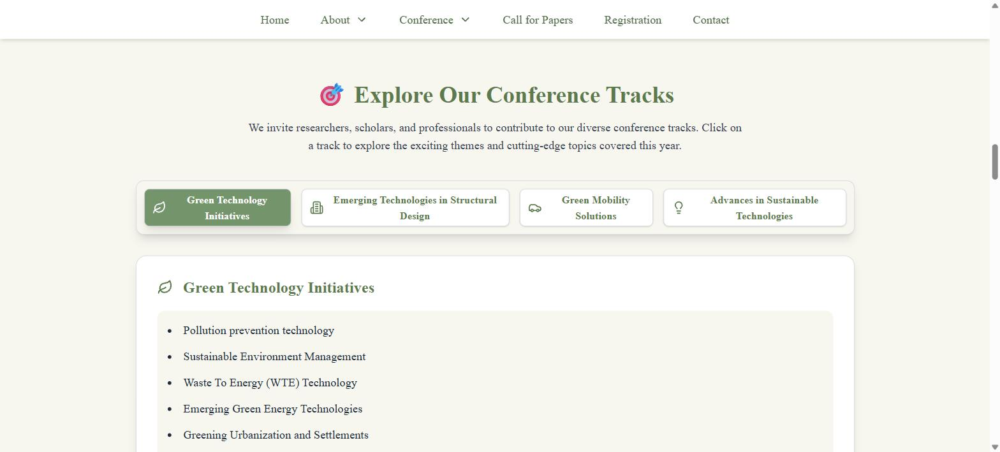
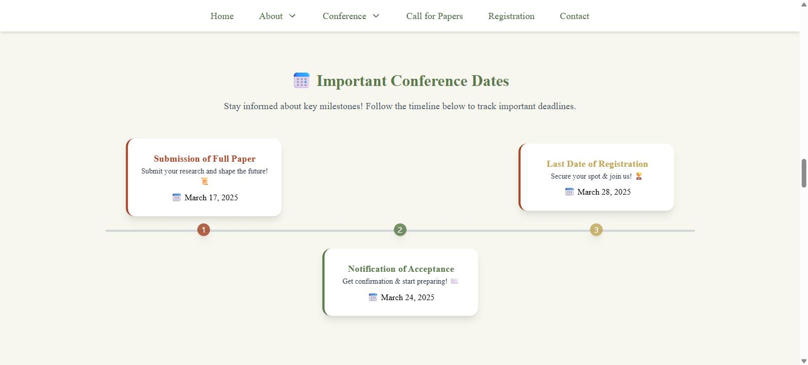
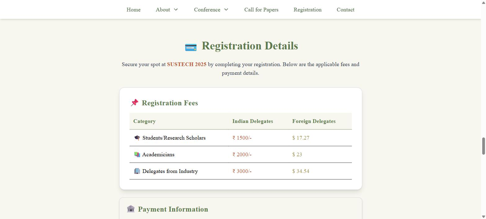

# SUSTECH 2025 — Conference Website

Single-page website for **SUSTECH 2025**, the International Conference on Sustainable Technologies
held online on 8 April 2025, organised by Saraswati College of Engineering (SCOE), Kharghar,
Navi Mumbai.

It is a static React site: one scrolling page with sections for the conference overview, the
college, the four paper tracks, key dates, the call for papers, registration fees, and the
organising committees. There is no backend — submissions are handled externally through
Microsoft CMT, and the site only links out to it.

## Screenshots

|  |  |
|:--|:--|
| <br>**Landing / conference intro** | <br>**Conference tracks (tabbed)** |
| <br>**Important dates** | <br>**Registration fees** |

## Running it

Requires Node 18+ (developed on Node 24).

```bash
npm install
npm run dev      # http://localhost:5173
```

| Script | What it does |
|---|---|
| `npm run dev` | Vite dev server with HMR |
| `npm run build` | Production build into `dist/` |
| `npm run preview` | Serve the built `dist/` locally |
| `npm run lint` | ESLint over the repo (currently reports errors — see Notes) |

`npm run build` produces roughly 3.8 MB of output, most of it images. The JS bundle is a single
~597 kB chunk (~192 kB gzipped) and Vite warns about the chunk size.

## How the content is organised

Almost all copy — titles, track topics, dates, fees, committee names, contact numbers — lives in
one file: **`src/assets/values.jsx`**. It exports plain objects (`conferenceData`, `scoeContent`,
`conferenceTracks`, `timelineData`, `callForPapersData`, `registrationData`, `patronsData`,
`committeeData`, `advisoryCommittees`, `menuItems`, `appData`) which `src/pages/Home.jsx` maps over
to render each section.

So for the common case — updating a deadline, adding a topic to a track, changing a fee, adding a
committee member — you edit `values.jsx` and nothing else. Layout changes go in `Home.jsx`.

## Structure

```
src/
├── assets/
│   ├── values.jsx        all page content + image imports
│   └── images/           logos, banners, campus photos, portraits (~3.2 MB)
├── components/
│   ├── Navbar.jsx        desktop nav; turns solid white after 50px of scroll
│   ├── Footer.jsx        links + organiser contact numbers
│   └── ui/               shadcn/ui components (button, card, tabs, sheet, …)
├── pages/Home.jsx        every section of the page, in order
├── lib/utils.js          the `cn()` class-merge helper
├── App.jsx               header logos, mobile drawer, router, layout shell
└── main.jsx              entry point
```

Navigation is smooth-scroll (`react-scroll`) between sections on a single page, not real routing.
React Router is present but only registers `/` → `Home`.

## Built with

React 19, Vite 6, Tailwind CSS 4 (via `@tailwindcss/vite`), Radix UI primitives wrapped as
shadcn/ui components, Framer Motion for the float and fade animations, Swiper for the banner
carousel, and Lucide for icons.

## Deploying

`npm run build`, then serve `dist/` from any static host. If you host it under a subpath rather
than at the domain root, uncomment and adjust `base` in `vite.config.js` (there is already a
commented-out `base: '/sustech2025/'`).

## Notes and known rough edges

These are real issues in the current code, listed so nobody re-discovers them the hard way:

- **`tailwind.config.js` is not actually used.** Tailwind 4 with the Vite plugin is configured
  from CSS, and `src/index.css` has no `@config` directive, so the theme, keyframes and animations
  defined in that file are inert. The file also contains code that would throw if it were loaded
  (it calls `React.useEffect` outside a component and references an undefined
  `flattenColorPalette`).
- **`index.html` links `output.css`**, which does not exist in the repo. It is a harmless 404 —
  styles come from `src/index.css` through Vite.
- **Two mobile menu links do nothing.** In `appData.menu.conferenceDetails` the ids are `tracks`
  and `call-for-papers`, but the actual sections are `conference-tracks` and `call-for-paper`. The
  desktop nav uses the correct ids and works.
- **"Playfair Display" is never loaded.** It is applied via `className` throughout but there is no
  `@font-face` or font link, so it falls back to a system serif unless the visitor happens to have
  it installed. The same applies to the `font-blackletter` class used in the call-for-papers
  section.
- **`npm run lint` currently fails** with 77 problems (73 errors, 4 warnings). The bulk are
  `react/prop-types` errors on the generated shadcn/ui components; the rest are the
  `tailwind.config.js` problems above, `no-undef` on `__dirname` in `vite.config.js`, and an unused
  import in `Home.jsx`.
- **Console warning about nested anchors** on the desktop nav: `react-scroll`'s `Link` renders an
  `<a>` and wraps Radix's `NavigationMenuLink`, which renders another.
- `vite.config.js` contains a top-level `theme` key with font settings. Vite ignores unknown keys,
  so it has no effect — it is Tailwind-shaped config in the wrong file.
- All dates, fees and deadlines in `values.jsx` are from the April 2025 event and are now past.

## Credits

Site content and imagery belong to Saraswati College of Engineering
([sce.edu.in](https://www.sce.edu.in/)). Peer review for the conference was managed through
Microsoft CMT.

`package.json` declares the ISC license, but no `LICENSE` file is checked in.
